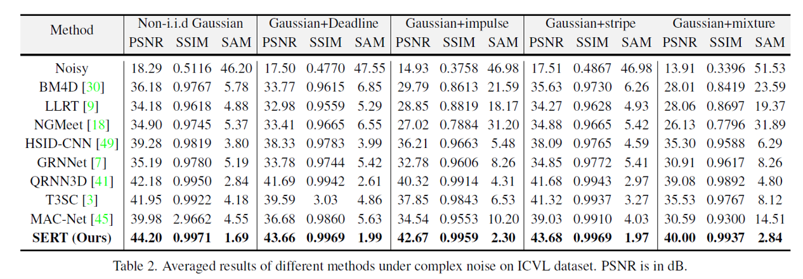

# Spectral Enhanced Rectangle Transformer for Hyperspectral Image Denoising

> **Abstract:** * Denoising is a crucial step for Hyperspectral image (HSI) applications. Though witnessing the great power of deep learning, existing HSI denoising methods suffer from limitations in capturing the non-local self-similarity. Transformers have shown potential in capturing long-range dependencies, but few attempts have been made with specifically designed Transformer to model the spatial and spectral correlation in HSIs. In this paper, we address these issues by proposing a spectral enhanced rectangle Transformer, driving it to explore the non-local spatial similarity and global spectral low-rank property of HSIs. For the former, we exploit the rectangle self-attention horizontally and vertically to capture the non-local similarity in the spatial domain. For the latter, we design a spectral enhancement module that is capable
of extracting global underlying low-rank property of spatial-spectral cubes to suppress noise, while enabling the interactions among non-overlapping spatial rectangles. Extensive experiments have been conducted on both synthetic noisy HSIs and real noisy HSIs, showing the effectiveness of our proposed method in terms of both objective metric and subjective visual quality.*

## Network Architecture

 

## Contents
1. [Models](#Models)
1. [Datasets](#Datasets)
1. [Training and Testing](#Training)
1. [Results](#Results)

 

## Models

|  Task   | Method  | Params (M)  | Dataset  |        Model Zoo                           |             
| :-----: | :------ | :--------: | :--------: | :----------------------------------------------------------: | 
|   Gaussian noise    | SERT  |   1.91    | ICVL | [Google Drive](https://drive.google.com/file/d/1Wsqyh66JRwiwn2FH-xxG-fdwmgBACBq9/view?usp=share_link) |
|   Complex noise     | SERT   |   1.91    | Urban100 |   [Google Drive](https://drive.google.com/file/d/1Pivpngcn5JkNzM1GZWq70M2mSuyX9Q3f/view?usp=share_link) | 
|   Real Noise | SERT |   1.90    | Urban | [Google Drive](https://drive.google.com/file/d/1r7VtOcRUPo9Tfjwy39i3g59Vi4aoI6K_/view?usp=share_link) | 
| Real Noise| SERT     |  8.00      |   Realistic dataset   | [Google Drive](https://drive.google.com/file/d/1zuaphGGw52FUBZ5fsYbHd4la88p7LoD7/view?usp=share_link) | 

## Datasets

## Training and Testing

## Results

<strong>Denoising on Random noise (ICVL)</strong> (click to expand) 

 

<strong>Denoising on Complex noise (ICVL)</strong> (click to expand) 

 
 

<strong>Denoising on Realistic noise </strong> (click to expand) 

 
 

<strong>Denoising on Urban dataset</strong> (click to expand) 

 

