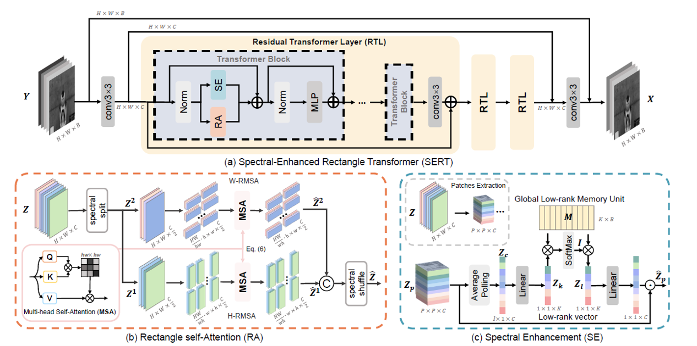
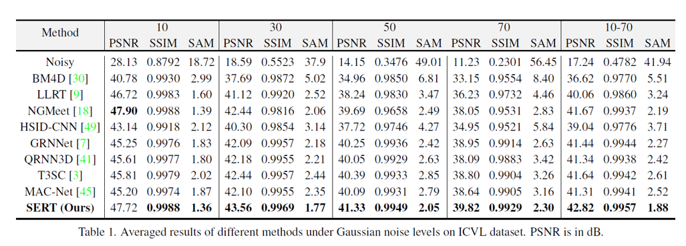
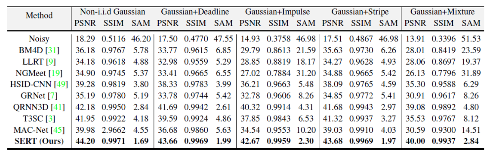
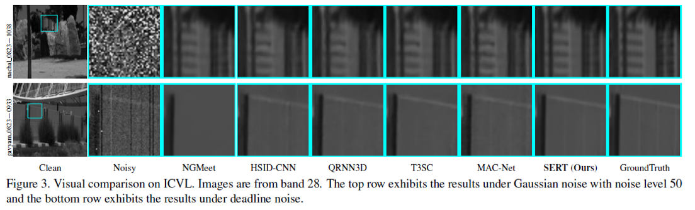
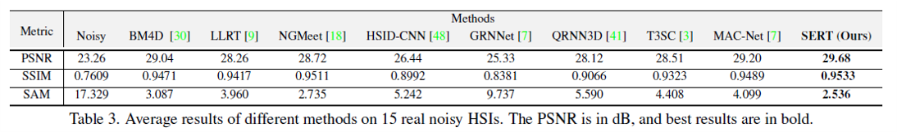
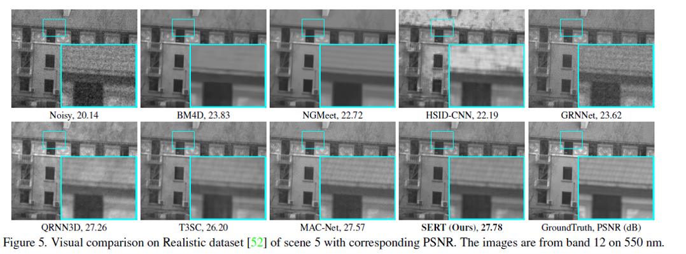
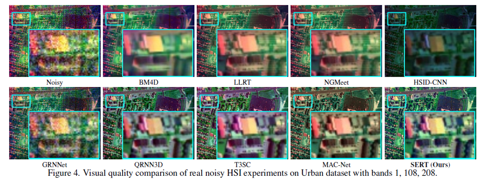

# Spectral Enhanced Rectangle Transformer for Hyperspectral Image Denoising

Miaoyu Li, Ji Liu, [Ying Fu](https://ying-fu.github.io/), [Yulun Zhang](http://yulunzhang.com/), and Dejing Dou, "Spectral Enhanced Rectangle Transformer for Hyperspectral Image Denoising" CVPR 2023

[Arxiv](http://arxiv.org/abs/2304.00844) 


<hr />

> **Abstract:**  Denoising is a crucial step for Hyperspectral image (HSI) applications. Though witnessing the great power of deep learning, existing HSI denoising methods suffer from limitations in capturing the non-local self-similarity. Transformers have shown potential in capturing long-range dependencies, but few attempts have been made with specifically designed Transformer to model the spatial and spectral correlation in HSIs. In this paper, we address these issues by proposing a spectral enhanced rectangle Transformer, driving it to explore the non-local spatial similarity and global spectral low-rank property of HSIs. For the former, we exploit the rectangle self-attention horizontally and vertically to capture the non-local similarity in the spatial domain. For the latter, we design a spectral enhancement module that is capable
of extracting global underlying low-rank property of spatial-spectral cubes to suppress noise, while enabling the interactions among non-overlapping spatial rectangles. Extensive experiments have been conducted on both synthetic noisy HSIs and real noisy HSIs, showing the effectiveness of our proposed method in terms of both objective metric and subjective visual quality.
<hr />

## Network Architecture

 

## Contents
1. [Models](#Models)
1. [Datasets](#Datasets)
1. [Training and Testing](#Training)
1. [Results](#Results)

<a id="Models"></a> 

## Models

We also provide the checkpoints of our competing methods.
### Quantitative Comparison on ICVL Dataset
| Method  | Publication| Params (M)  | GFLOPs  (512×512×31) | Model Zoo (Gaussian noise)   |  Model Zoo (Complex noise)             
| :------ | :--------: | :--------: | :--------: | :--------: | :----------------------------------------------------------: | 
| [GRNet](https://ieeexplore.ieee.org/document/9397278)  |  TGRS 2022 | 41.44    | 610.7| [Google Drive](https://drive.google.com/drive/folders/1dJ0zK1GBlR7T_0VG4zpP5mgkdUoA8KF1?usp=share_link) | [Google Drive](https://drive.google.com/drive/folders/1dJ0zK1GBlR7T_0VG4zpP5mgkdUoA8KF1?usp=share_link) |
| [QRNN3D](https://arxiv.org/abs/2003.04547)  |TNNLS 2020 |   0.86  | 2513.7 |[Google Drive](https://drive.google.com/drive/folders/1A30K04dUzDwOlWyvlIq-uj6i1Jw5zHVx?usp=share_link) |   [Google Drive](https://drive.google.com/drive/folders/1A30K04dUzDwOlWyvlIq-uj6i1Jw5zHVx?usp=share_link) | 
| [T3SC](https://arxiv.org/abs/2111.09708) | NeurIPS 2021 | 0.83    | - | [Google Drive](https://drive.google.com/drive/folders/1ICEe9vyQjs9p3D09i2cSPJeYyy9vAOq3?usp=share_link) | [Google Drive](https://drive.google.com/drive/folders/1ICEe9vyQjs9p3D09i2cSPJeYyy9vAOq3?usp=share_link) | 
| [MACNet](https://ieeexplore.ieee.org/document/9631264)  |  TGRS 2022 |   0.43  | -  |   [Google Drive](https://drive.google.com/drive/folders/1c96i_L7KqiXgEl4xhiwYPTA_pbd75xYB?usp=share_link)   | [Google Drive](https://drive.google.com/file/d/1zuaphGGw52FUBZ5fsYbHd4la88p7LoD7/view?usp=share_link) | 
| [SST](http://arxiv.org/abs/2211.14090)  | AAAI 2023  |   4.10  | 2082.4` |   [Google Drive](https://drive.google.com/drive/folders/1U4qYx0IGsfkqEskRmuJMBDCt-EVPGC1_?usp=sharing)   | [Google Drive](https://drive.google.com/drive/folders/1U4qYx0IGsfkqEskRmuJMBDCt-EVPGC1_?usp=sharing) | 
|[SERT]()| CVPR 2023 | 1.91 |  1018.9 | [Google Drive](https://drive.google.com/drive/folders/1PQv7nZREOrYaC65gBdDRAEthoTRa9q0h?usp=share_link)  | [Google Drive](https://drive.google.com/drive/folders/1PQv7nZREOrYaC65gBdDRAEthoTRa9q0h?usp=share_link)

### Quantitative Comparison on Realistic Dataset
| Method  | Params (M)  | GFLOPs(512×512×34) | PSNR |Model Zoo 
| :------ | :--------: | :--------: | :--------: |:--------:  | 
| [GRNet](https://ieeexplore.ieee.org/document/9397278)  |   44.40    | 611.9 | | [Google Drive](https://drive.google.com/drive/folders/1SmUMKHmlYkngMpSQ_nlfnaDJYQ4ZyI0U?usp=share_link) |
| [QRNN3D](https://arxiv.org/abs/2003.04547)    |   0.86  | 2756.9 | |[Google Drive](https://drive.google.com/drive/folders/1SmUMKHmlYkngMpSQ_nlfnaDJYQ4ZyI0U?usp=share_link) |
| [T3SC](https://arxiv.org/abs/2111.09708) |   0.83    | - |  | [Google Drive](https://drive.google.com/drive/folders/1SmUMKHmlYkngMpSQ_nlfnaDJYQ4ZyI0U?usp=share_link)
| [MACNet](https://ieeexplore.ieee.org/document/9631264)  |   0.43  | -  |  | [Google Drive](https://drive.google.com/drive/folders/1SmUMKHmlYkngMpSQ_nlfnaDJYQ4ZyI0U?usp=share_link)  |
|[SST](http://arxiv.org/abs/2211.14090)| 2.14 |  | | [Google Drive](https://drive.google.com/drive/folders/1SmUMKHmlYkngMpSQ_nlfnaDJYQ4ZyI0U?usp=sharing)
|[SERT]()| 1.91 | 1021.9 | | [Google Drive](https://drive.google.com/drive/folders/1RHk37FpGw6qrpAsq7mPMmOPXWSynurXo?usp=share_link)  

### Quantitative Comparison on Apex/Urban Dataset
| Method  | Params (M)  | GFLOPs | Model Zoo 
| :------ | :--------: | :--------: | :--------: |
| [GRNet](https://ieeexplore.ieee.org/document/9397278)   |   44.53    |  | [Google Drive](https://drive.google.com/drive/folders/132YNE5TqiBcpA479NLFtSYQEY9ge8NRX?usp=share_link)  |
| [QRNN3D](https://arxiv.org/abs/2003.04547)    |   0.86  | |[Google Drive](https://drive.google.com/drive/folders/132YNE5TqiBcpA479NLFtSYQEY9ge8NRX?usp=share_link)  |
| [T3SC](https://arxiv.org/abs/2111.09708) |   0.83   | |[Google Drive](https://drive.google.com/drive/folders/132YNE5TqiBcpA479NLFtSYQEY9ge8NRX?usp=share_link) | 
| [MACNet](https://ieeexplore.ieee.org/document/9631264)    |   0.43    |   |[Google Drive](https://drive.google.com/drive/folders/132YNE5TqiBcpA479NLFtSYQEY9ge8NRX?usp=share_link)   | 
[SST](http://arxiv.org/abs/2211.14090)  |22.76 |   |[GoogleDriver](https://drive.google.com/file/d/1HsPvLVP76vgAZj-9QiSVkAz9Uw_Iwc5d/view?usp=share_link)|
|[SERT]()| 8 |  | [Google Drive](https://drive.google.com/drive/folders/1tf09Gnn7dvIpF_mmGKvfsm3WWe_ghHxi?usp=sharing)  |

<a id="Datasets"></a>
## Datasets

### ICVL 
* The entire ICVL dataset download link: https://icvl.cs.bgu.ac.il/hyperspectral/
1. split the entire dataset into training samples, testing samples and validating samples. The files used in training are listed in utility/icvl_partition/icvl_train_list.txt.
2. generate lmdb dataset for training

```
python utility/lmdb_data.py
```

3. download the testing data from BaiduDisk or generate them by yourself through

```
python utility/mat_data.py
```

### Realistic Dataset
* Please refer to [[github-link]](https://github.com/ColinTaoZhang/HSIDwRD) for "Hyperspectral Image Denoising with Realistic Data in ICCV, 2021" to download the dataset

Testing HSIs are listed in utility/realistic_partition/test.txt. Other HSIs in the dataset are used for training. 

### Urban dataset
* The training dataset are from link: https://apex-esa.org/. The origin Urban dataset are from link:  https://rslab.ut.ac.ir/data.

1. Run the create_big_apex_dataset() funtion in utility/mat_data.py to generate training samples.

2. Run the createDCmall() function in utility/lmdb_data.py to generate training lmdb dataset.


<a id="Training"></a>

## Training and Testing
### ICVL Dataset
```
#for gaussian noise
#----training----
python hside_simu.py -a sert_base -p sert_base_gaussian

#----testing---- The results are shown in Table 1 in the main paper.
python hside_simu_test.py -a sert_base -p sert_base_gaussian_test -r -rp checkpoints/icvl_gaussian.pth --test-dir /icvl_noise/512_50
```

```
#for comlpex noise
#----training----
python hside_simu_complex.py -a sert_base -p sert_base_complex

#----testing---- The results are shown in Table 2 in the main paper.
python hside_simu_test.py -a sert_base -p sert_base_complex_test -r -rp checkpoints/icvl_complex.pth --test-dir  /icvl_noise/512_mix
```

### Urban Dataset
```
#----training----
python hside_urban.py -a sert_urban -p sert_urban 

#----testing----  The results are shown in Figure 4 in the main paper.
python hside_urban_test.py -a sert_urban -p sert_urban_test -r -rp ./checkpoints/real_urban.pth
```

### Realistic Dataset
```
#----training----
python hside_real.py -a sert_real -p sert_real

#----testing---- The results are shown in Table 3 in the main paper.
python hside_real_test.py -a sert_real -p sert_real_test -r -rp ./checkpoints/real_realistic.pth
```


<a id="Results"></a>

## Results

<details>
<summary><strong>Denoising on Random noise (ICVL)</strong> (click to expand) </summary>
 
</details>

<details>
<summary><strong>Denoising on Complex noise (ICVL)</strong> (click to expand) </summary>
 
 

</details>

<details>
<summary><strong>Denoising on Realistic noise </strong> (click to expand) </summary>
 
 
</details>

<details>
<summary><strong>Denoising on Urban dataset</strong> (click to expand) </summary>

 
</details>

## Citations

If you find the code helpful in your resarch or work, please cite the following paper(s).

```
@inproceedings{li2023spatial,
    title={Spatial-Spectral Transformer for Hyperspectral Image Denoising},
    author={Li, Miaoyu and Fu, Ying and Zhang, Yulun},
    booktitle={AAAI},
    year={2023}
}
@inproceedings{li2023spectral,
    title={Spectral Enhanced Rectangle Transformer for Hyperspectral Image Denoising},
    author={Miaoyu Li and Ji Liu and Ying Fu and Yulun Zhang and Dejing Dou},
    booktitle={CVPR},
    year={2023}
}
```

## Acknowledgement
The codes are based on [QRNN3D](https://github.com/Vandermode/QRNN3D).
